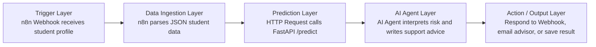

# Agentic AI Architecture Diagram

## Layer Explanation

Trigger Layer:
The workflow starts when student information is submitted to an n8n webhook.

Data Ingestion Layer:
n8n receives the JSON payload and passes it to the prediction request.

Prediction Layer:
The workflow calls the deployed FastAPI model endpoint and receives the predicted risk level, probability values, and a rule-based recommended action.

AI Agent Layer:
The AI Agent reads the prediction result and turns it into a clearer academic support recommendation.

Action / Output Layer:
The workflow returns the recommendation to the caller or sends it to an advisor through an automated notification channel.
